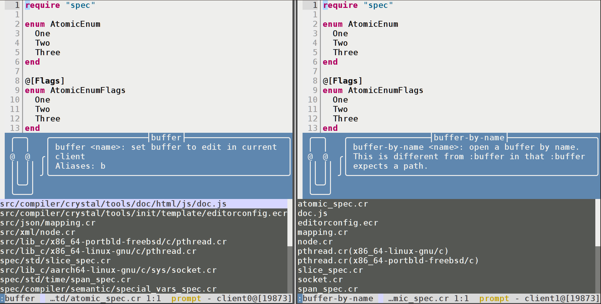

# buffer-by-name.kak

[](https://opensource.org/licenses/Apache-2.0)

**buffer-by-name.kak** is a [Kakoune](https://github.com/mawww/kakoune) plugin
that provides a command, `:buffer-by-name`, for opening buffers by their names
as opposed to their relative or absolute paths.
The command is an opinionated alternative to the built-in command `:buffer`
with the advantage of giving generally cleaner command completions.
Here is a comparison:



When buffer names are not distinctive enough, `:buffer-by-name` intelligently
shows just enough of the directory components of buffers to disambiguate them.
The format of such buffers is `name(directory)`, so that the buffer names
consistently comes first.

## Installation

### With plug.kak

You can install **buffer-by-name.kak** using the
[plug.kak](https://github.com/andreyorst/plug.kak) plugin manager by extending
your `kakrc` with:

```kak
plug "jbomanson/buffer-by-name.kak" config %{
    require-module buffer-by-name
    # Optional suggestion:
    alias global b buffer-by-name
}
```

Then restart Kakoune and run `:plug-install`.

### Manually

In your `kakrc`, include:

```sh
source "/path/to/buffer-by-name.kak/rc/buffer-by-name.kak"
require-module buffer-by-name
# Optional suggestion:
alias global b buffer-by-name
```

## Usage

Use the `:buffer-by-name <name>` function to open buffers instead of the
built-in `:buffer`.
If you prefer it over `:buffer`, I would suggest to consider an alias
like in the installation examples for added convenience.

## Alternatives

- [kakoune-buffers](https://github.com/Delapouite/kakoune-buffers)
  eases navigation between opened buffers by showing an info box and the ability
  to jump to specific buffers.
